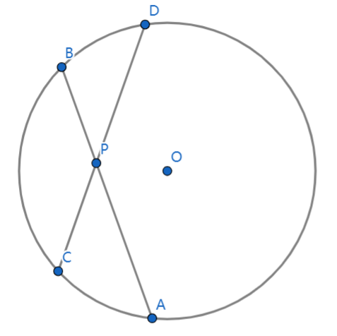
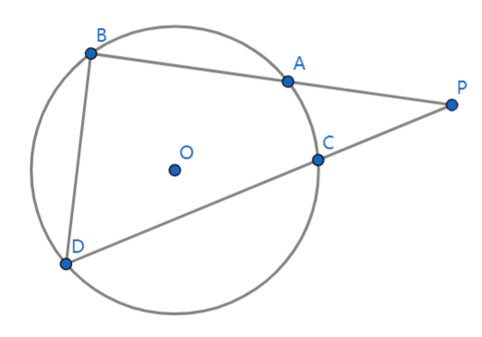
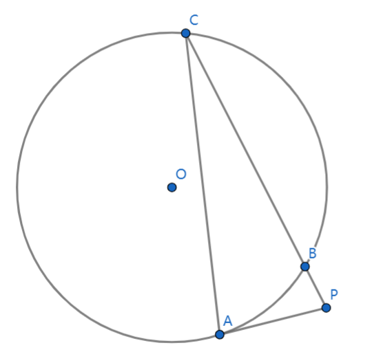

## 相交弦定理

$PA\times PB = PC\times PD$

定义：圆的两条相交弦中，每条弦被交点所分的两条线段的乘积相等

## 割线定理

$PA\times PB = PC\times PD$

定义：从圆外一点引圆的两条割线，这一点到每条割线与圆焦点的两条线段的积相等

## 切割线定理

$PA^2 = PB\times PC$

定义：从圆外一点引圆的切线和割线，切线长是这点到割线与圆交点的两条线段的比例中项
