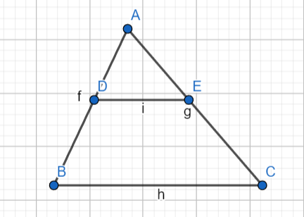
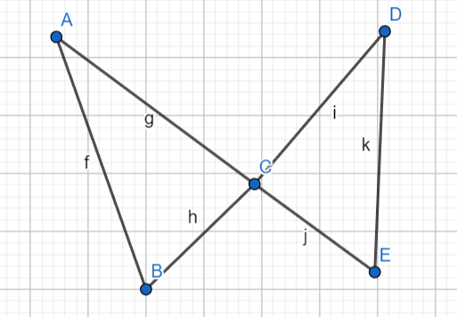
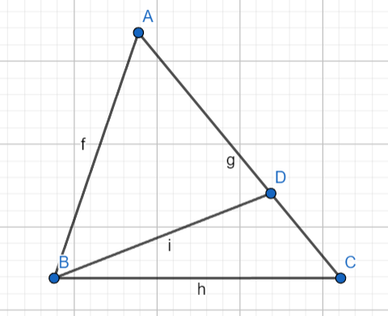
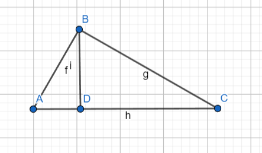
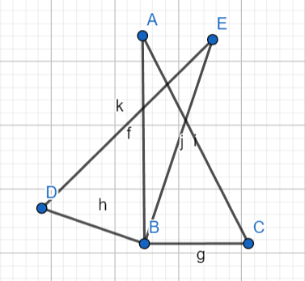
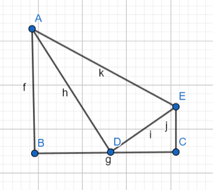
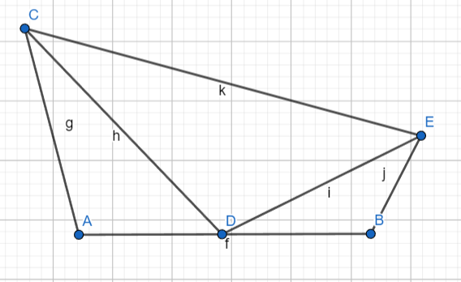
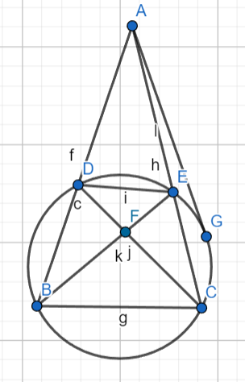

## 平行线分线段成比例（预备定理）
### A字型（正A，反A，双A）

已知： $DE \parallel BC$

结论： $▲ADE∽▲ABC$

### 8字型（正8，反8，双8）

已知： $∠A=∠D$

结论： $▲EAC∽▲EDB$

或

已知： $∠A=∠B$

结论： $▲EAC∽▲EBD$

***
## 蝴蝶形

已知： $∠BAC=∠ECD$ $∠ABC=∠DEC$

结论： $▲CAB∽▲CDE$

## 斜A字

已知： $∠ADC=∠ACB$

结论： $▲ACD∽▲ABC$

### 射影定理（特殊斜A字）

已知： $AB⊥BC$ $BD⊥AC$

结论：
- $AB^2=AD \times AC$
- $CB^2=CD \times CA$
- $BD^2=AD \times CD$

***
## 公共角（二次相似题型）

已知： $∠ABC=∠EBD$

结论： $▲ABC∽▲EBD$

***
## 一线三垂直（平面直角坐标系）

已知： $∠B=∠ADE=∠C$

结论：
- $▲ABD∽EC=BD \times DC$
- $点C为中点时还与▲ADE相似$

***
## 一线三等角

已知： $∠A=∠CDE=∠B$

结论：
- $▲ACD∽▲BDE$
- $AC \times BE=AD \times DB$
- $当D为AB中点时还与▲DCE相似$

***
## 四点共圆

已知： $∠DBE=∠ECD$（张角相等）

  或 $∠ADE=∠ECB$（外角与它的内对角相等）
 
  或 $∠CBD=∠CED$（四边形的一组对角互补）
 
  或 $BF=CF=DF=EF$（四个点到一个定点的距离相等）
 
满足以上任意一种判定方法的条件均可证明四点共圆

结论：
1. $∠ABC+∠CED=180°$ $∠ACB+∠EDB=180°$
2. $B,C,E,D$ 四点共圆
3. $∠DEB=∠DCB$（同弧所对的圆周角相等）
4. $∠EDA=∠BCA$（外角等于内对角，可通过（1）、（2）得到）
5. $▲ADE∽▲ACB$（两三角形三个内角对应相等，可由（2）得到）
6. $DF \times CF=EF \times BF$（相交弦定理）
7. $AD \times AB=AE \times AC$（割线定理）
8. $AG^2=AD \times AB=AE \times AC$（切割线定理）
9. $BD \times CE+BC \times DE=CD \times BE$（托勒密定理）

