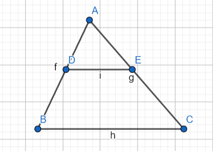
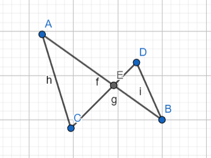
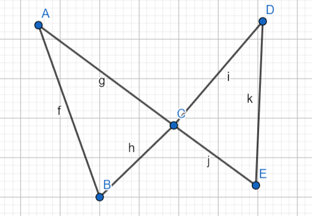
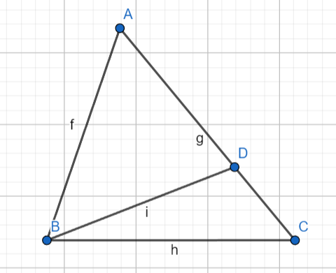
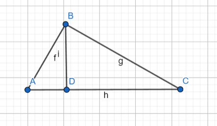
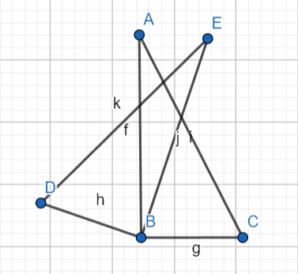
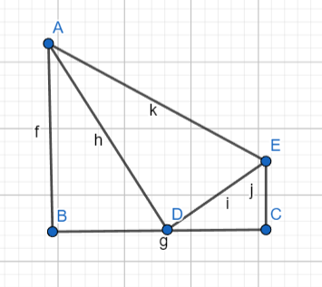
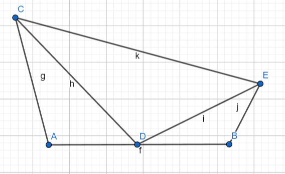
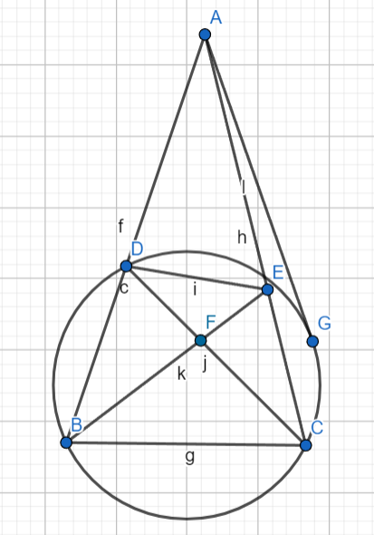

## 平行线分线段成比例（预备定理）
### A字型（正A，反A，双A）

已知：$DE \parallel BC$
结论：$▲ADE∽▲ABC$

### 8字型（正8，反8，双8）

已知：$∠A=∠D$

结论：$▲EAC∽▲EDB$

或

已知：$∠A=∠B$

结论：$▲EAC∽▲EBD$

***
## 蝴蝶形

已知：$∠BAC=∠ECD$ $∠ABC=∠DEC$

结论：$▲CAB∽▲CDE$

## 斜A字

已知：$∠ADC=∠ACB$

结论：$▲ACD∽▲ABC$

### 射影定理（特殊斜A字）

已知：$AB⊥BC$ $BD⊥AC$

结论：
- $AB^2=AD*AC$
- $CB^2=CD*CA$
- $BD^2=AD*CD$

***
## 公共角（二次相似题型）

已知：$∠ABC=∠EBD$

结论：$▲ABC∽▲EBD$

***
## 一线三垂直（平面直角坐标系）

已知：$∠B=∠ADE=∠C$

结论：
- $▲ABD∽EC=BD*DC$
- $点C为中点时还与▲ADE相似$

***
## 一线三等角

已知：$∠A=∠CDE=∠B$

结论：
- $▲ACD∽▲BDE$
- $AC*BE=AD*DB$
- $当D为AB中点时还与▲DCE相似$

***
## 四点共圆

已知：$∠DBE=∠ECD$

结论：
1. $∠ABC+∠CED=180°$ $∠ACB+∠EDB=180°$
2. $B,C,E,D$ 四点共圆
3. $∠DEB=∠DCB$（同弧所对的圆周角相等）
4. $∠EDA=∠BCA$（外角等于内对角，可通过（1）、（2）得到）
5. $▲ADE∽▲ACB$（两三角形三个内角对应相等，可由（2）得到）
6. $DF*CF=EF*BF$（相交弦定理）
7. $AD*AB=AE*AC$（割线定理）
8. $AG^2=AD*AB=AE*AC$（切割线定理）
9. $BD*CE+BC*DE=CD*BE$（托勒密定理）

